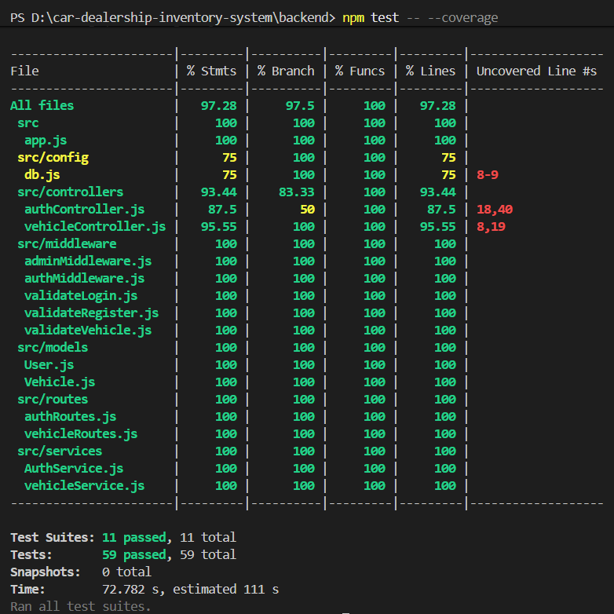
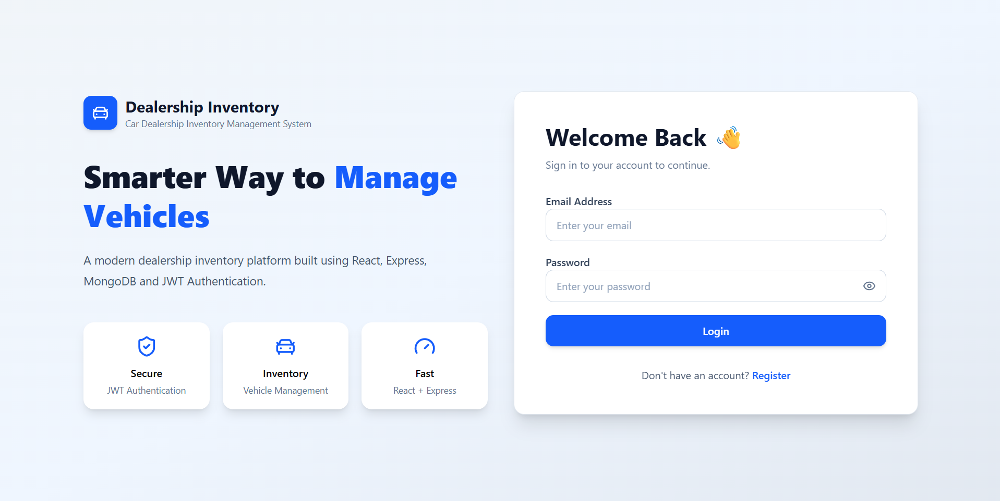
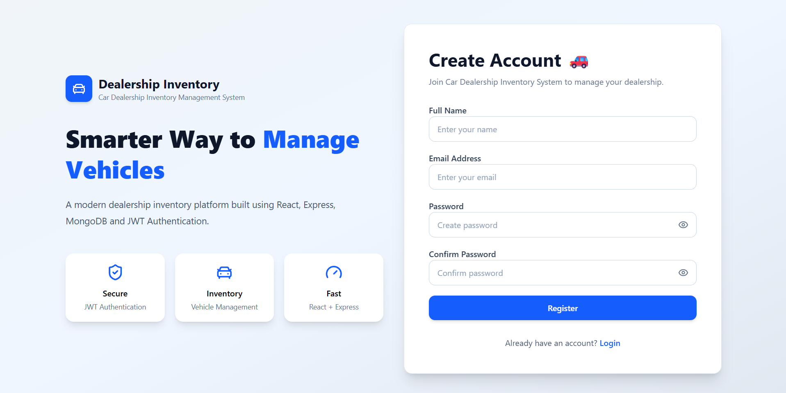
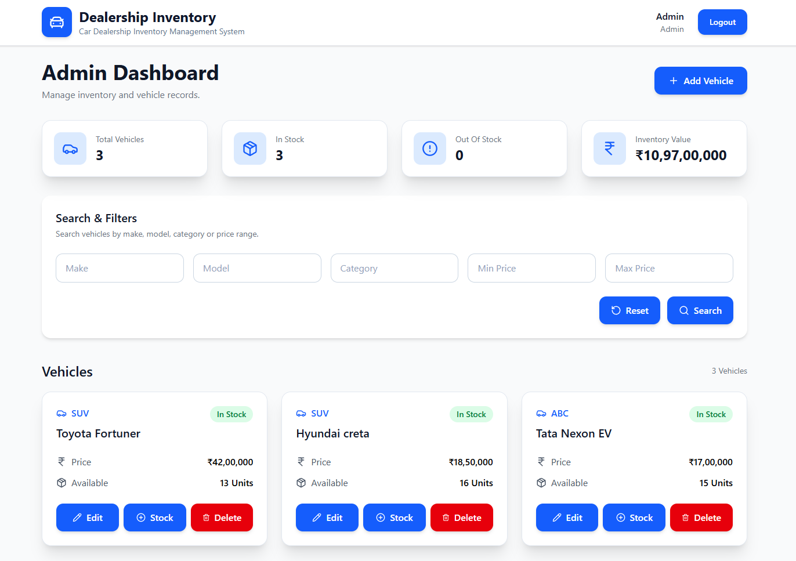
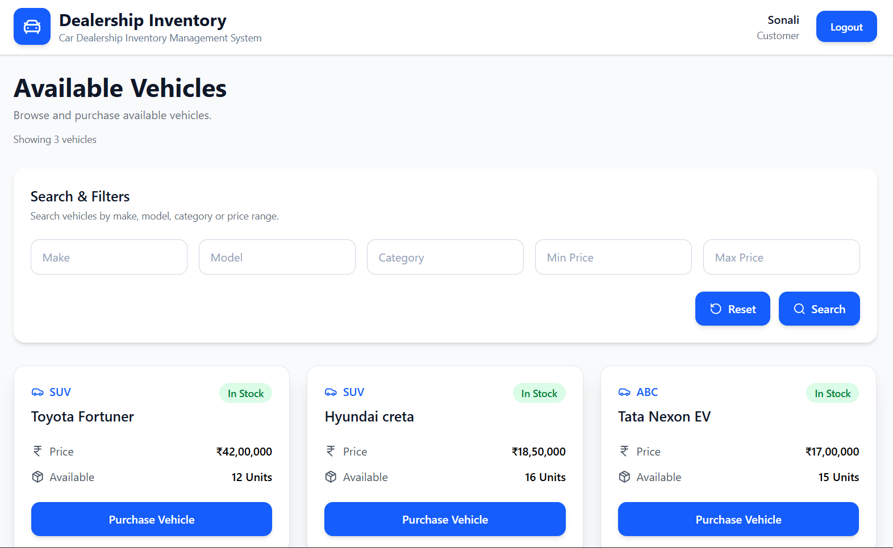
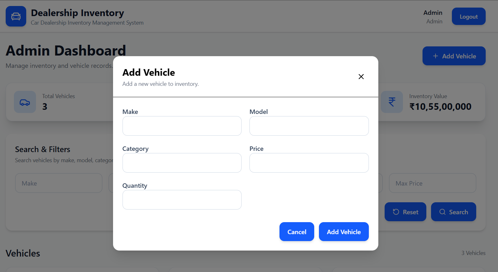
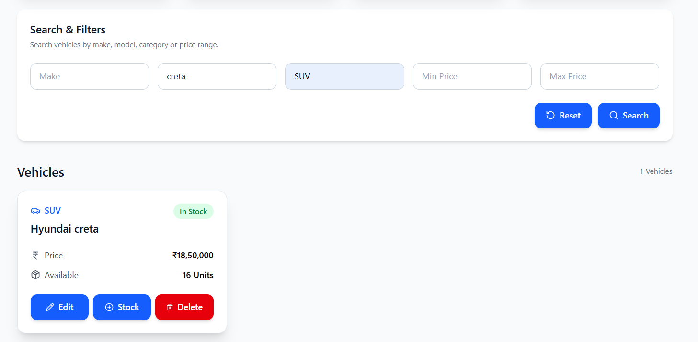
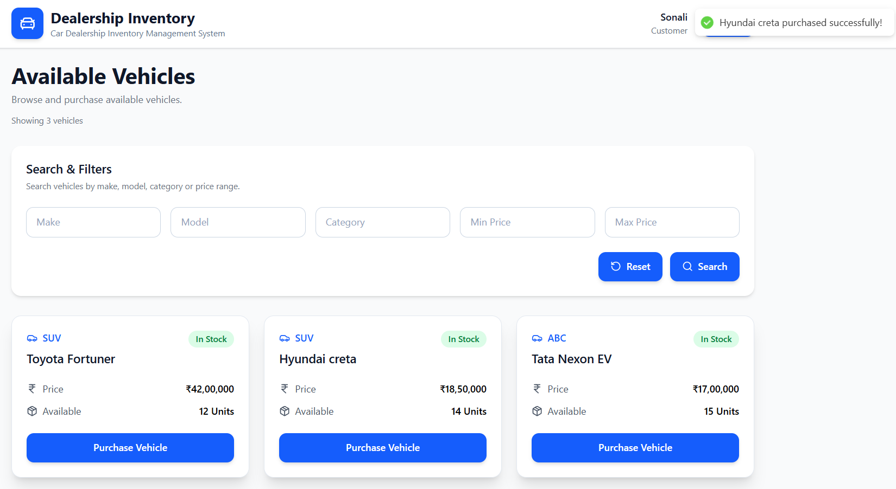

# 🚗 Car Dealership Inventory Management System

A full-stack **Car Dealership Inventory Management System** built using **React, Node.js, Express, and MongoDB Atlas**.

The application enables secure authentication, role-based access control, vehicle inventory management, purchasing workflow, and advanced search functionality while following **Test-Driven Development (TDD)** principles.

This project was developed as part of the **Incubyte Software Craftsman Internship Assessment**.

---

# 🌐 Live Demo

### Frontend (Vercel)

https://car-dealership-inventory-web.vercel.app

### Backend API (Render)

https://car-dealership-inventory-system-4qum.onrender.com

> **Note:** The backend is hosted on Render's free tier. If the application has been inactive, the first request may take **30–60 seconds** while the server wakes up.

---

# ✨ Features

## 🔐 Authentication

- ✅ User Registration
- ✅ User Login
- ✅ Secure JWT Authentication
- ✅ Password Hashing (bcrypt)
- ✅ Persistent Login
- ✅ Protected Routes
- ✅ Role-Based Authorization

---

## 👨‍💼 Admin Features

- ✅ Add Vehicle
- ✅ Update Vehicle
- ✅ Delete Vehicle
- ✅ Restock Vehicle Inventory
- ✅ Admin Dashboard with Inventory Statistics
- ✅ Advanced Vehicle Search & Filtering

---

## 👤 Customer Features

- ✅ Browse Available Vehicles
- ✅ Search Vehicles
- ✅ Purchase Vehicle
- ✅ Automatic Inventory Updates
- ✅ Disabled Purchase Button for Out-of-Stock Vehicles

---

## 📦 Inventory Management

- ✅ View Complete Inventory
- ✅ Search by Make
- ✅ Search by Model
- ✅ Search by Category
- ✅ Filter by Price Range

---

## 🎨 User Interface

- ✅ Responsive Design
- ✅ Modern Dashboard
- ✅ Clean User Experience
- ✅ Loading Indicators
- ✅ Error Handling

---

# 🛠 Tech Stack

## Frontend

- React (Vite)
- Tailwind CSS
- React Router DOM
- Axios
- Context API

## Backend

- Node.js
- Express.js
- MongoDB Atlas
- Mongoose
- JWT Authentication
- bcryptjs

## Testing

- Jest
- Supertest

## Deployment

- Vercel
- Render
- MongoDB Atlas

---

# 🏗 Architecture

## Backend Architecture

```
Routes
   ↓
Middleware
   ↓
Controllers
   ↓
Services
   ↓
Models
   ↓
MongoDB Atlas
```

## Frontend Architecture

```
Pages
   ↓
Components
   ↓
Context
   ↓
Services
   ↓
REST API
```

## Deployment Architecture

```
React (Vercel)
        │
        ▼
Express API (Render)
        │
        ▼
MongoDB Atlas
```

---

# 📁 Project Structure

```
car-dealership-inventory
│
├── backend
│   ├── controllers
│   ├── middleware
│   ├── models
│   ├── routes
│   ├── services
│   ├── tests
│   ├── app.js
│   └── server.js
│
├── frontend
│   ├── src
│   │   ├── components
│   │   ├── context
│   │   ├── hooks
│   │   ├── pages
│   │   ├── routes
│   │   ├── services
│   │   └── utils
│   │
│   ├── public
│   └── vercel.json
│
├── README.md
├── PROMPTS.md
└── .gitignore
```

---

# 🚀 Getting Started

## Clone Repository

```bash
git clone https://github.com/<your-username>/<repository-name>.git
cd car-dealership-inventory
```

---

# ⚙ Backend Setup

```bash
cd backend
npm install
```

Create a `.env` file.

```env
PORT=5000
MONGODB_URI=<your_mongodb_connection_string>
JWT_SECRET=<your_secret_key>
```

Start the backend.

```bash
npm run dev
```

---

# 💻 Frontend Setup

```bash
cd frontend
npm install
```

Create a `.env` file.

```env
VITE_API_URL=http://localhost:5000/api
```

Run the frontend.

```bash
npm run dev
```

---

# 🚀 Production Environment

When deploying to Vercel, configure the following environment variable:

```env
VITE_API_URL=https://car-dealership-inventory-system-4qum.onrender.com/api
```

---

# 🔑 Demo Credentials

## Administrator

```
Email:
admin@gmail.com

Password:
Admin123

Role:
Administrator
```

---

# 📡 REST API

| Method | Endpoint | Access |
|---------|----------|--------|
| POST | `/api/auth/register` | Public |
| POST | `/api/auth/login` | Public |
| GET | `/api/vehicles` | Public |
| GET | `/api/vehicles/search` | Public |
| POST | `/api/vehicles` | Admin |
| PUT | `/api/vehicles/:id` | Admin |
| DELETE | `/api/vehicles/:id` | Admin |
| POST | `/api/vehicles/:id/purchase` | Authenticated |
| POST | `/api/vehicles/:id/restock` | Admin |

---

# 🧪 Testing

This project follows a **Test-Driven Development (TDD)** approach using **Jest** and **Supertest**.

Tests were written before or alongside implementation to validate authentication, authorization, inventory management, and purchase workflows.

## Tested Modules

### Authentication

- ✅ User Registration
- ✅ User Login

### Vehicle Management

- ✅ Create Vehicle
- ✅ Get All Vehicles
- ✅ Search Vehicles
- ✅ Update Vehicle
- ✅ Delete Vehicle

### Inventory

- ✅ Purchase Vehicle
- ✅ Restock Vehicle

### Middleware

- ✅ JWT Authentication Middleware
- ✅ Admin Authorization Middleware

## Testing Tools

- Jest
- Supertest

Run tests:

```bash
npm test
```

---

## Test Results

```text
Test Suites: 11 passed, 11 total
Tests:       59 passed, 59 total
Snapshots:   0 total
Time:        72.782 s
```

---

## Code Coverage

| Metric | Coverage |
|---------|----------|
| Statements | **97.28%** |
| Branches | **97.50%** |
| Functions | **100%** |
| Lines | **97.28%** |

### Coverage Summary

- ✅ 11 Test Suites Passed
- ✅ 59 Test Cases Passed
- ✅ 97.28% Statement Coverage
- ✅ 97.50% Branch Coverage
- ✅ 100% Function Coverage

---

# 📷 Application Screenshots

## Test Report

<p align="center">

</p>

---

## Login

<p align="center">

</p>

---

## Register

<p align="center">

</p>

---

## Admin Dashboard

<p align="center">

</p>

---

## Customer Dashboard

<p align="center">

</p>

---

## Add / Edit Vehicle

<p align="center">

</p>

---

## Search & Filtering

<p align="center">

</p>

---

## Purchase Workflow

<p align="center">

</p>

---

## Home Page

<p align="center">

</p>

---

# 🤖 My AI Usage

## AI Tools Used

- ChatGPT (GPT-5.5)
- GitHub Copilot

## How AI Was Used

### ChatGPT

- Application architecture
- Folder structure planning
- Test-Driven Development planning
- Backend API design
- Authentication flow
- CRUD workflow design
- Purchase workflow
- Inventory management
- Search implementation
- Responsive UI improvements
- Error handling
- Testing strategy
- README preparation

### GitHub Copilot

- Boilerplate generation
- Code completion
- Refactoring suggestions

All AI-generated code and suggestions were manually reviewed, understood, modified where necessary, and tested before being committed.

## Reflection

AI accelerated boilerplate generation, architecture discussions, and testing strategy while allowing me to focus on implementation, debugging, and code quality. Every AI-assisted suggestion was critically reviewed and validated before becoming part of the final project.

---

# 📄 PROMPTS.md

This repository includes a **PROMPTS.md** file documenting the AI prompts used throughout development, as required by the assessment.

---

# 📜 License

Developed for the **Incubyte Software Craftsman Assessment**.